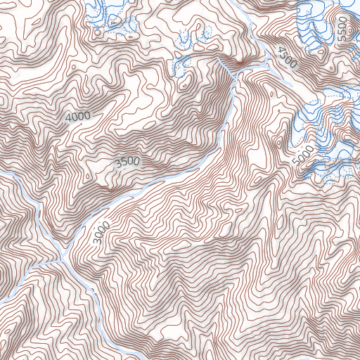

# Imhof

A light-weight topography map inspired by Eduard Imhof.

### Map Data Layers

Imhof uses the following MapBox Studio source layers:

* mapbox.mapbox-streets-v5 *Map data © OpenStreetMap contributors*
* mapbox.mapbox-terrain-v2
* glacier data from [GLIMS](https://www.glims.org/)
